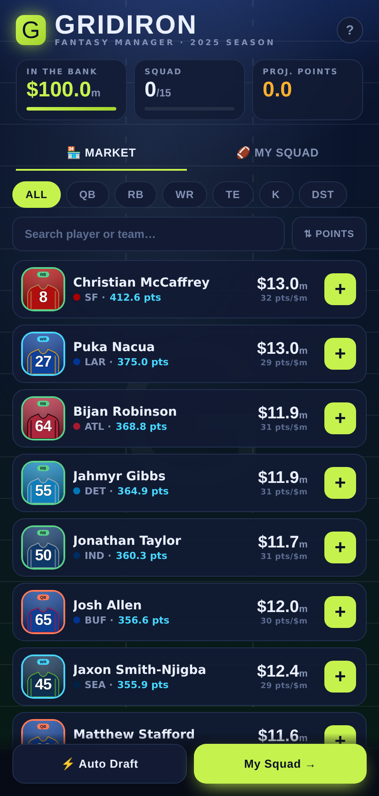
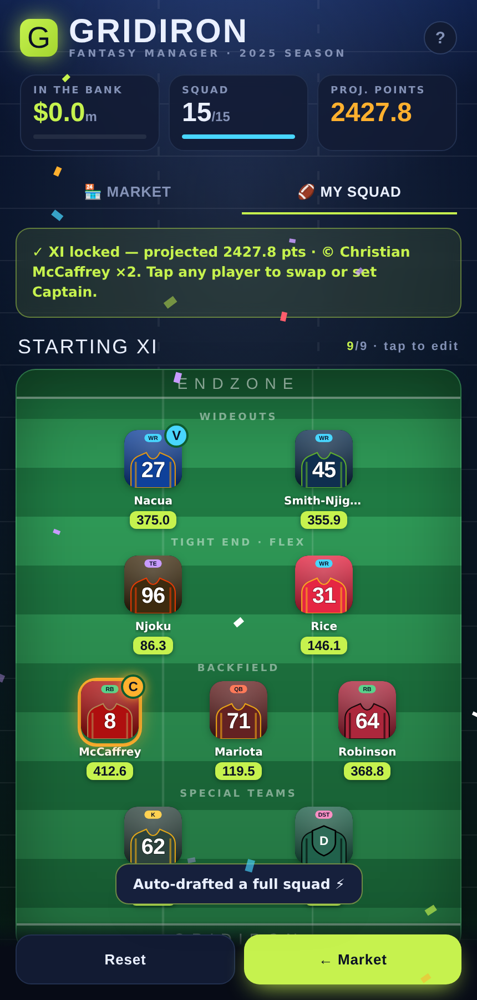

# 🏈 Gridiron Fantasy

An engaging NFL fantasy squad-builder game, built as a self-contained web app and
packaged with **Capacitor** for the **Google Play Store**.

Draft a 15-player squad under a **$100m** salary cap, line up 9 starters in a formation
on an animated football field, name a Captain for double points, and chase the highest
projected score. Uses real **2025 NFL season** production (PPR) for points and prices.




---

## What's inside

```
learninglab/
├── www/                    ← the app (this is Capacitor's webDir)
│   ├── index.html
│   ├── css/styles.css
│   ├── js/
│   │   ├── teams.js        ← 32-team color identities
│   │   ├── players.js      ← generated 2025 player pool (268 players)
│   │   ├── avatars.js      ← stylized jersey avatars + real-photo hook
│   │   ├── confetti.js     ← celebration effects
│   │   └── app.js          ← game rules, formation UI, persistence, native glue
│   ├── manifest.webmanifest
│   ├── sw.js               ← offline cache (PWA/browser build)
│   └── icons/              ← app + favicon PNGs
├── resources/              ← 1024px icon + splash sources for @capacitor/assets
├── scripts/
│   ├── make_icons.py       ← regenerate icons/splash
│   ├── process.py          ← how the player pool was built (provenance)
│   ├── players_2025.json   ← raw processed data
│   ├── serve.js            ← local dev server
│   └── smoke.mjs           ← headless browser smoke test
├── capacitor.config.json
├── package.json
└── docs/PLAY_STORE.md      ← step-by-step Play Store guide
```

## Run it locally (browser)

```bash
npm run serve         # → http://localhost:5178
```

No build step — it's plain HTML/CSS/JS so it runs anywhere.

## Build for Google Play

See **[docs/PLAY_STORE.md](docs/PLAY_STORE.md)** for the full walkthrough. Two paths:

**Easiest — build in CI (no local Android setup):** the `.github/workflows/android-build.yml`
workflow builds the app on GitHub's servers. Trigger it from the **Actions** tab and download the
`gridiron-debug-apk` artifact to install on a phone; add signing secrets to also get a Play-ready
`.aab`. (This exists because Google's Android SDK/Maven servers are often blocked in sandboxes.)

**Local — Android Studio:**

```bash
npm install
npx cap add android           # creates the native android/ project
npm run assets                # generate launcher icons + splash from resources/
npx cap sync
npx cap open android          # opens Android Studio → build a signed AAB
```

## Features

- **Animated stadium field** backdrop with yard lines, hash marks and a light sweep.
- **On-field formation view** — starters laid out by role on a green field, with
  Captain (©, ×2) and Vice-Captain badges.
- **Stylized player avatars** in each team's colors (jersey, number, position). See
  "Player photos" below to wire in real headshots later.
- **Salary-cap draft** with live bank meter, per-team limits, and one-tap **Auto Draft**.
- **Haptics**, confetti, toasts, and an onboarding walkthrough.
- **Offline & persistent** — your squad saves locally; no account or network required.

## Player photos

The app ships with team-colored jersey avatars that work fully offline and carry no
licensing risk. If you later obtain rights to real headshots, implement one function —
the avatar stays as an automatic fallback:

```js
// in www/js/avatars.js (or a new script loaded before app.js)
window.getPhotoUrl = (p) => `https://your-cdn.example/headshots/${p.id}.png`;
```

> ⚠️ Real NFL player photos, team logos, and names are trademarked. Shipping them without
> a license can get an app removed from Google Play. The stylized avatars avoid this.

## Data

Points and prices come from real 2025 NFL season totals (nflverse / Fantasy.NFL.com),
processed by `scripts/process.py` using PPR scoring. D/ST is approximated from defensive
stats. Prices are scaled within position bands so the $100m cap forces real trade-offs.
See the script header for the full documented assumptions.

## License / disclaimer

Fan-made project for learning and personal use. Not affiliated with or endorsed by the
NFL or any team. Team colors are approximations; player art is original and stylized.
